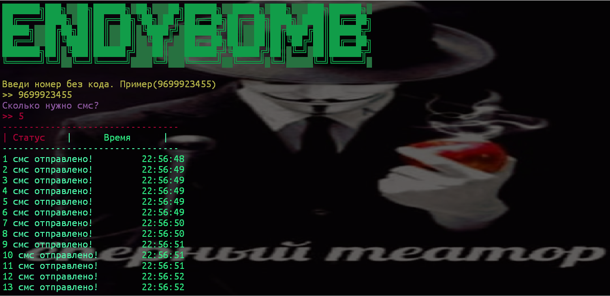

# EndyBomb-er

## О бомбере
Данный бомбер имеет мало сервисов, но красивый дизайн. 
Данный бомбер имеет простой интерфейс, а также оптимизацию под многие устройства!
### Установка windows/linux/mac/termux/ish

1. **Скачивание библиотек**
```sh
git - git-scm.com/downloads
```
*ОБЕЗАТЕЛЬНО ПОСТАВТЕ ГАЛОЧКУ PATH!*
```sh
python - python.org    
```
**Для temux**
```sh

pkg install git

pkg install python3
```
**linux**
```sh
sudo apt-get python
```
2. **Установка репозитория**
```sh
git clone https://github.com/EndyCat/EndyBomb-er

cd C:\Path-to-director или cd(для termux)

cd EndyBomb-er  

pip install -r requirements.txt
```
3. **Запуск**
```sh
cd C:\Path-to-director или cd(для termux)

cd EndyBomb-er  

python3 endy-bomb.py
```
